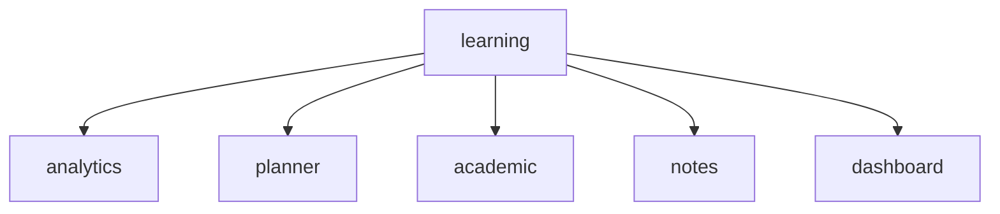
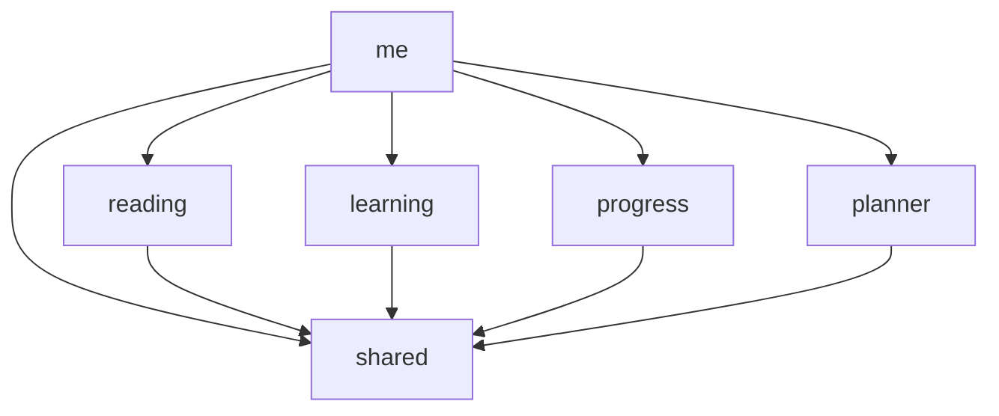

# ADR 0002: Domain Bounded Context Splitting

## Status
Accepted

## Context & Problem
The `modules/learning` directory had become an overloaded catch-all monolith containing unrelated domains such as analytics, academic planning, generic dashboards, and core learning features (notes, citations). This lack of bounded context led to high conceptual coupling and prevented strict dependency inversion, making the codebase fragile as new features were added.

### Before Dependency Graph

*Note: In the previous state, all of these sub-domains were treated as a single massive 'learning' bounded context, creating cyclic dependencies when analytics needed to track progress from learning features.*

## Decision
We are explicitly defining and separating domains according to their business boundaries:
- **`learning`**: Owns strictly learning mechanics (Notes, Flashcards, Vocabulary, Tests, Citations).
- **`progress`**: Owns user advancement tracking (Goals, Streaks, Analytics).
- **`planner`**: Owns time management (Schedules, Deadlines, Study Plans, Academic terms).
- **`me`**: Integrates the personal center (Aggregating views like the dashboard).

### After Dependency Graph

*Note: Domains (reading, learning, progress, planner) are now strictly forbidden from importing each other (preventing circular dependencies). Coordination happens solely in the integration layer (`me` or application orchestrators) or via `shared` interfaces.*

## Alternatives Considered
- **Keeping a nested structure (`learning/progress`)**: Rejected because progress analytics applies to `reading` just as much as `learning`, meaning it deserves its own top-level domain boundary.

## Consequences
- **Positive**: Strict acyclic dependency graph. Easier module ownership.
- **Negative**: Requires a large initial refactoring of import paths.
- **Rule**: "Move code, don't rewrite code." This ADR strictly authorizes moving the physical directories and fixing imports, without changing the internal API contracts of the modules.
