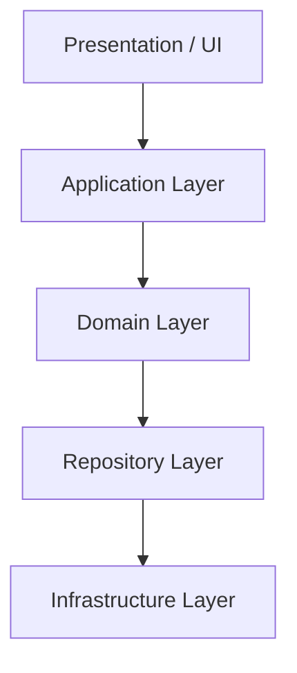

# TomeSphere Core Architecture

## Status: FROZEN 🧊

This document captures the foundational architectural decisions for TomeSphere. These decisions have been stabilized after completing Phase 10 (Performance Tuning & Legacy Cleanup) and should be considered **frozen**. 

Any proposed changes to these foundational patterns require an Architecture Decision Record (ADR) and a formal review process. Future development should focus on **capabilities** rather than foundational architecture.

---

## 1. Architectural Principles

> **PROJECT RULE: No new architecture phases without an Architecture Decision Record (ADR).** 
> If a developer wishes to introduce a new abstraction, repository layer, event system, or persistence model, it must be explicitly justified and approved via an ADR. This prevents architecture drift.

1. **Keep business rules in the application layer:** Database functions/RPCs are strictly used for atomicity and persistence logic (thin orchestrators), never for business policies.
2. **Event-Driven State Propagation:** Domain boundaries communicate strictly via domain events asynchronously.
3. **CQRS for Read Models:** Do not query transactional tables for complex reporting. Compute and project facts into specialized read models (`analytics_user_daily`, `discovery_search_documents`).
4. **Facts over Policy in Data:** Store durable facts in the database. Leave subjective calculations (e.g., "favorite genre" affinity) to the application layer.
5. **Features drive development:** Development in TomeSphere is now driven by product features and user capabilities, heavily utilizing the stable architecture.

---

## 2. Layered Architecture



- **Presentation:** React Server Components (Next.js App Router).
- **Application Layer:** Command Handlers, Query Handlers, and UI integration logic.
- **Domain Layer:** Entities, Value Objects, Aggregates, Domain Events, standard types.
- **Infrastructure Layer:** Repositories implementations, DB client initializations.

---

## 3. Bounded Contexts & Ownership

TomeSphere is divided into explicit Bounded Contexts. Modules should only depend on each other via Shared Core or asynchronous Events.

- **Platform:** Authentication, Authorization, App Shell, Core Navigation.
- **Reading:** `ReaderSession`, Progress tracking, Bookmarks.
- **Library:** `LibraryBook`, User Shelves, Want-to-Read lists.
- **Discovery:** Recommendations, Semantic Search, Trending.
- **Analytics:** Reading reports, Insights, Reading Goals.
- **Catalog/Books:** Canonical book metadata.
- **Profile:** User identities, Avatars.

---

## 4. Transactional Outbox Pattern

All cross-context asynchronous communication flows through the Transactional Outbox to guarantee atomic persistence.

```text
Aggregate
   ↓
Repository (via RPC)
   ↓ 
Canonical Tables + Outbox Table (Atomic Commit)
   ↓
Relay Cron Job (`app/api/cron/process-outbox`)
   ↓
Event Bus
   ↓
Projection Store Event Handlers (e.g. Analytics, Discovery)
```

**Key Components:**
- **RPCs:** `save_reader_session_with_events`, `save_book_action_with_events`.
- **Relay Process:** Automatically claims messages using `FOR UPDATE SKIP LOCKED`.

---

## 5. Read Models and Projections

To maintain extremely fast queries for UI components, data is pre-projected into read-optimized models by Background Event Handlers.

### Analytics Read Models
- `analytics_user_daily`
- `analytics_user_monthly`
- `analytics_user_genres`
- `analytics_book_statistics`

### Discovery Read Models
- `discovery_search_documents`
- `discovery_category_documents`
- `discovery_recommendation_signals`

**Rule:** Do not write real-time multi-join reporting queries against transactional tables in the application. Subscribe to events and populate a projection instead.
