# TomeSphere V1 Complete ERD

**Database Version**: V1.0  
**Status**: Frozen  

This is the unified visualizer graph mapping all tables and cross-domain foreign keys across the entire V1 database.

```mermaid
erDiagram
    direction TB
    books ||--o{ annotations : "has"
    highlights ||--o{ annotations : "has"
    profiles ||--o{ annotations : "has"
    books ||--o{ book_assets : "has"
    authors ||--|| book_authors : "has"
    books ||--|| book_authors : "has"
    books ||--o{ book_files : "has"
    books ||--|| book_genres : "has"
    genres ||--|| book_genres : "has"
    books ||--|| book_subjects : "has"
    subjects ||--|| book_subjects : "has"
    books ||--o{ bookmarks : "has"
    profiles ||--o{ bookmarks : "has"
    books ||--o{ discovery_search_documents : "has"
    profiles ||--o{ export_requests : "has"
    books ||--o{ featured_books_projection : "has"
    books ||--o{ highlights : "has"
    profiles ||--o{ highlights : "has"
    books ||--o{ library_books : "has"
    profiles ||--o{ library_books : "has"
    books ||--o{ new_arrivals_projection : "has"
    books ||--o{ notes : "has"
    profiles ||--o{ notes : "has"
    profiles ||--o{ notifications : "has"
    books ||--o{ popular_books_projection : "has"
    outbox_events ||--|| processed_events : "has"
    outbox_events ||--o{ projection_checkpoints : "has"
    profiles ||--o{ reading_goals : "has"
    books ||--o{ reading_progress : "has"
    profiles ||--o{ reading_progress : "has"
    books ||--o{ reading_sessions : "has"
    profiles ||--o{ reading_sessions : "has"
    discovery_search_documents ||--o{ search_history : "has"
    profiles ||--o{ search_history : "has"
    books ||--o{ shelf_items : "has"
    shelves ||--o{ shelf_items : "has"
    profiles ||--o{ shelves : "has"
    books ||--o{ trending_books_projection : "has"
    profiles ||--|| user_preferences : "has"
    profiles ||--|| user_statistics : "has"

    annotations {
        text body_markdown
        text book_id FK
        text created_at
        text highlight_id FK
        text id PK
        jsonb location_anchor
        text updated_at
        text user_id FK
    }
    announcements {
        text content
        text created_at
        text ends_at
        text id PK
        boolean is_active
        boolean is_dismissible
        text link_text
        text link_url
        text starts_at
        text title
        text type
        text updated_at
    }
    authors {
        text avatar_url
        text bio
        text created_at
        text id PK
        text name
        text slug
        text updated_at
    }
    book_assets {
        text asset_type
        text asset_url
        text book_id FK
        text created_at
        text id PK
    }
    book_authors {
        text author_id PK,FK
        text book_id PK,FK
    }
    book_files {
        text book_id FK
        text checksum
        text created_at
        text format
        text id PK
        boolean is_primary
        text mime_type
        numeric size
        text storage_path
        numeric version
    }
    book_genres {
        text book_id PK,FK
        text genre_id PK,FK
    }
    book_subjects {
        text book_id PK,FK
        text subject_id PK,FK
    }
    bookmarks {
        text book_id FK
        text created_at
        text id PK
        text label
        numeric page_number
        text user_id FK
    }
    books {
        text cover_url
        text created_at
        text description
        numeric download_count
        text edition
        text embedding
        text epub_url
        numeric file_size
        numeric file_size_mb
        text format
        tsvector fts
        text hash
        text id PK
        boolean is_featured
        boolean is_textbook
        text isbn
        text language
        numeric pages
        text pdf_url
        text publisher
        text release_date
        text series
        numeric series_order
        text title
        numeric total_pages
        text updated_at
        numeric view_count
    }
    discovery_autocomplete_documents {
        text id PK
        text indexed_by
        text query
        numeric score
        text source_updated_at
        text updated_at
    }
    discovery_search_documents {
        text authors
        text availability_status
        text book_id FK
        text categories
        text cover_url
        text description
        numeric download_count
        tsvector fts_tokens
        text indexed_at
        text indexed_by
        text keywords
        text language
        numeric popularity_score
        numeric projection_version
        numeric publication_year
        numeric rating
        text source_updated_at
        text subtitle
        text title
        text updated_at
    }
    export_requests {
        text completed_at
        text download_url
        text error_message
        text expires_at
        text id PK
        text queued_at
        text requested_at
        enum status
        text user_id FK
    }
    faqs {
        text answer
        text category
        text created_at
        numeric display_order
        text id PK
        text question
    }
    featured_books_projection {
        text book_id FK
        numeric featured_order
        text updated_at
    }
    genres {
        text created_at
        text description
        text icon
        text id PK
        text name
        text slug
        text updated_at
    }
    highlights {
        text book_id FK
        text color
        text created_at
        text id PK
        jsonb location_anchor
        text selected_text
        text user_id FK
    }
    job_failures {
        text error
        text failed_at
        text id PK
        text job_type
        jsonb payload
        numeric retry_count
        text stack_trace
        text worker
    }
    job_queue {
        numeric attempts
        text completed_at
        text created_at
        text id PK
        text job_type
        text last_error
        jsonb payload
        text scheduled_at
        text started_at
        text status
        text updated_at
    }
    library_books {
        text added_at
        text book_id FK
        text id PK
        numeric queue_order
        enum status
        text updated_at
        text user_id FK
    }
    new_arrivals_projection {
        text arrival_date
        text book_id FK
        text updated_at
    }
    notes {
        text book_id FK
        text content
        text created_at
        text id PK
        text tags
        text title
        text updated_at
        text user_id FK
    }
    notifications {
        text body
        text created_at
        text id PK
        jsonb metadata
        text read_at
        text title
        text type
        text user_id FK
    }
    outbox_events {
        text aggregate_id
        text aggregate_type
        text created_at
        text event_type
        numeric event_version
        text id PK
        text last_error
        text occurred_at
        jsonb payload
        text processed_at
        numeric retry_count
        text status
    }
    pages {
        text content
        text published_at
        text slug
        text title
        text updated_at
    }
    popular_books_projection {
        text book_id FK
        numeric popularity_score
        text updated_at
    }
    processed_events {
        numeric duration_ms
        text event_id PK,FK
        text handler PK
        text processed_at
    }
    profiles {
        text avatar_url
        text bio
        text created_at
        text display_name
        text id PK
        text location
        text updated_at
    }
    projection_checkpoints {
        text last_processed_event_id FK
        text projection_name
        text updated_at
    }
    reading_goals {
        text created_at
        numeric current_value
        text end_date
        text goal_type
        text id PK
        boolean is_active
        text start_date
        numeric target_value
        text updated_at
        text user_id FK
        numeric year
    }
    reading_progress {
        text book_id FK
        text last_read_at
        jsonb location_anchor
        text user_id FK
    }
    reading_sessions {
        text book_id FK
        numeric current_page
        text finished_at
        text id PK
        text last_read_at
        numeric percentage
        numeric reading_time_minutes
        text started_at
        numeric total_pages
        text user_id FK
    }
    search_history {
        text clicked_document_id FK
        text id PK
        text normalized_query
        text query
        numeric result_count
        text searched_at
        text user_id FK
    }
    shelf_items {
        text added_at
        text book_id FK
        text id PK
        numeric position
        text shelf_id FK
    }
    shelves {
        text cover_image
        text created_at
        text description
        text id PK
        boolean is_public
        text name
        text updated_at
        text user_id FK
    }
    subjects {
        text created_at
        text description
        text id PK
        text name
        text slug
        text updated_at
    }
    tags {
        text created_at
        text id PK
        text name
        text slug
        numeric usage_count
    }
    trending_books_projection {
        numeric all_time_rank
        numeric all_time_score
        text book_id FK
        numeric daily_rank
        numeric daily_score
        numeric monthly_rank
        numeric monthly_score
        text updated_at
        numeric weekly_rank
        numeric weekly_score
    }
    trending_searches {
        text id PK
        text last_executed
        text normalized_query
        numeric search_count
    }
    user_preferences {
        text created_at
        text dictionary_language
        text font_family
        numeric font_size
        numeric line_height
        text reader_theme
        text theme
        text updated_at
        text user_id PK,FK
    }
    user_statistics {
        numeric books_completed
        numeric books_started
        numeric current_streak
        numeric longest_streak
        numeric minutes_read
        numeric pages_read
        text updated_at
        text user_id PK,FK
    }
```

