# Reader Experience Domain Model

This document defines the core aggregates and concepts for the Reader Bounded Context. It explicitly models **reader semantics** rather than implementation details.

## Core Aggregates and Entities

```mermaid
graph TD
    Reader[Reader Domain]
    Reader --> ReaderPosition
    Reader --> ReadingSession
    Reader --> AnnotationFamily[Annotations]

    AnnotationFamily --> Highlight
    AnnotationFamily --> StandaloneNote[Standalone Note]
    AnnotationFamily --> HighlightNote[Highlight Note]
    AnnotationFamily --> Bookmark

    Highlight -.-> LocationAnchor
    StandaloneNote -.-> LocationAnchor
    HighlightNote -.-> Highlight
    Bookmark -.-> LocationAnchor
    ReaderPosition -.-> LocationAnchor
```

### 1. `LocationAnchor` (Value Object)

All positional references within the Reader domain must use a `LocationAnchor`.

- **Purpose:** Abstract away format-specific locators (e.g., EPUB CFI, PDF coordinates) so the domain remains format-agnostic.
- **Structure:** Encapsulates the type and value (e.g., `{ type: "epubcfi", value: "epubcfi(/6/4[chap01ref]!/4/3:27)" }`).
- **Rule:** The Reader domain _never_ understands pages as positional truth. "Page 52" is purely a presentation-layer calculation.

### 2. `ReaderPosition`

- **Purpose:** Tracks the user's latest reading location to support "Continue Reading" and "Session Resume".
- **Structure:** `bookId`, `locationAnchor`, `updatedAt`.
- **Rule:** This is distinct from a `ReadingSession`. A session updates the position over time, but the `ReaderPosition` is a singular state snapshot for resume purposes.

### 3. `ReadingSession`

- **Purpose:** A period of observed reading activity.
- **State Machine:**
  - `Active`: User is actively scrolling, interacting, or highlighting.
  - `Paused`: Triggered after a timeout threshold (e.g., 5 minutes) of _no observed interaction_.
  - `Resume`: Triggered automatically if interaction resumes.
  - `Ended`: Triggered by closing the reader, switching books, or explicit exit.
- **Rule:** This ensures the "Observed Reading Timer" is highly accurate and not merely based on app lifecycle times, providing accurate facts for the Analytics domain.

---

## The Annotation Family

Annotations represent location-based artifacts left by the user.

### 4. `Highlight`

- **Definition:** An annotation over _immutable book content_.
- **Structure:** Stores the `LocationAnchor` and the explicit string of selected text.
- **Rule:** The highlight owns metadata about the range, but not the text itself. The selected text is stored solely for previews, search indexing, and corruption detection.

### 5. `Note`

- **Definition:** A user's markdown-formatted thought attached to a reading location.
- **Variants:**
  1. **Standalone Note:** Anchored directly to a `LocationAnchor` (e.g., a general thought at the end of a chapter).
  2. **Highlight Note:** Anchored to a `Highlight` aggregate.
- **Rule:** Deleting a highlighted text range does not delete an attached Note. The Note simply reverts to a Standalone Note retaining its `LocationAnchor`.

### 6. `Bookmark`

- **Definition:** A saved reading position.
- **Structure:** Stores a `LocationAnchor`.
- **Rule:** A bookmark is _not_ a page marker. Because reflowable text shifts across pages depending on font size, the bookmark always points to the exact textual location (CFI) the user intended to mark.
